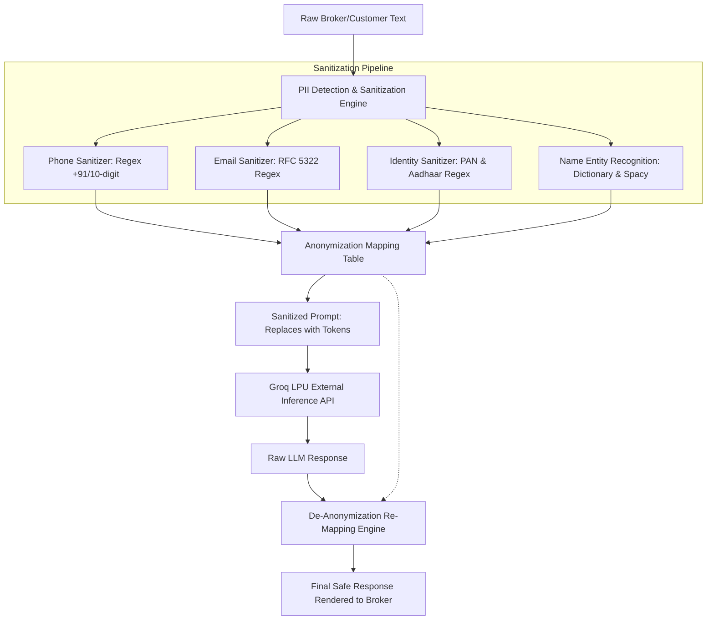

# BrokerIQ — AI Engine & Intelligence Architecture Specification

## 1. Overview & Operational Objectives

The BrokerIQ AI subsystem provides real-estate brokers with instant, intelligent automation directly in their mobile workflow. In the fast-paced Indian property market, brokers receive hundreds of unformatted WhatsApp messages, audio notes, and portal inquiries daily. 

The AI architecture is engineered to fulfill four core operational objectives:
1. **Sub-500ms Inference Latency**: Utilizing **Groq's Language Processing Unit (LPU)** hardware architecture to generate smart reply suggestions and lead feature extractions with near-zero waiting time on mobile.
2. **Absolute Privacy & Zero PII Leakage**: A mathematical guarantee that personally identifiable customer information (names, 10-digit Indian phone numbers, Aadhaar, PAN, emails) is scrubbed prior to dispatching prompts to external LLMs.
3. **Domain-Specific Real Estate Understanding**: Deep contextual parsing of Indian real-estate terminology: BHK configurations, super built-up vs carpet area, Lakhs and Crores, builder reputation, Vastu compliance, and possession timelines.
4. **Predictable Token Metering & Cost Controls**: Granular token usage recording against tenant quotas with automated fallback models and hard usage caps.

---

## 2. AI Provider Abstraction Interface

To prevent vendor lock-in to any single cloud model provider (e.g. OpenAI, Anthropic, Groq, local Ollama), BrokerIQ defines a strict `AIProvider` contract.

```typescript
// apps/api/src/modules/ai/providers/ai-provider.interface.ts

export interface LeadExtractedFeatures {
  budgetMin?: number;              // In INR units
  budgetMax?: number;              // In INR units
  propertyType?: string;           // 'APARTMENT' | 'VILLA' | 'PLOT' | 'COMMERCIAL'
  bhk?: string;                    // e.g. '3 BHK', '2.5 BHK'
  preferredLocalities: string[];   // e.g. ['Whitefield', 'Sarjapur Road']
  furnishing?: string;             // 'UNFURNISHED' | 'SEMI_FURNISHED' | 'FULLY_FURNISHED'
  possessionTimeline?: string;     // 'READY_TO_MOVE' | 'UNDER_CONSTRUCTION' | 'WITHIN_6_MONTHS'
  urgency: 'LOW' | 'MEDIUM' | 'HIGH';
  confidenceScore: number;         // 0.0 to 1.0
  rawNotesSummary: string;
}

export interface ConversationSummaryResult {
  summary: string;                 // Concise 2-3 sentence overview
  keyAgreements: string[];         // Explicit decisions reached
  clientObjections: string[];      // Concerns regarding price, location, floor
  nextActionItems: string[];       // Tasks (e.g. "Send brochure for Sobha Dream Acres")
  detectedSentiment: 'POSITIVE' | 'NEUTRAL' | 'NEGATIVE' | 'URGENT';
}

export interface ReplySuggestionOptions {
  conversationHistory: Array<{ role: 'user' | 'assistant' | 'contact'; content: string }>;
  leadContext?: {
    name?: string;
    stage?: string;
    budget?: string;
    preferredBhk?: string;
  };
  language?: 'en' | 'hi' | 'hinglish';
  tone?: 'professional' | 'warm' | 'urgent';
}

export interface PropertyMatchExplanation {
  matchScore: number;              // 0 to 100
  matchingFactors: string[];       // e.g. "Within budget (₹1.5 Cr)", "Exact location (Indiranagar)"
  mismatchFactors: string[];       // e.g. "Semi-furnished instead of Fully-furnished"
  recommendationPitch: string;     // Tailored broker talking point
}

export interface AIProvider {
  /**
   * Extracts structured criteria from unstructured chat notes or portal inquiries
   */
  extractLeadFeatures(rawText: string): Promise<LeadExtractedFeatures>;

  /**
   * Summarizes lengthy client chat threads into actionable deal dossiers
   */
  summarizeConversation(
    messages: Array<{ role: string; content: string }>
  ): Promise<ConversationSummaryResult>;

  /**
   * Proposes 3 high-converting contextual reply suggestions
   */
  generateReplySuggestions(
    options: ReplySuggestionOptions
  ): Promise<string[]>;

  /**
   * Evaluates inventory compatibility against lead preferences
   */
  explainPropertyMatch(
    leadPreferences: any,
    propertyDetails: any
  ): Promise<PropertyMatchExplanation>;
}
```

---

## 3. Groq LPU Integration & Model Strategy

BrokerIQ leverages **Groq's high-speed inference engine** via official REST endpoints (`https://api.groq.com/openai/v1/chat/completions`). Groq's Tensor Streaming architecture enables generation speeds exceeding 300 tokens/second, making real-time chat reply suggestions practical on mobile.

```
┌────────────────────────────────────────────────────────────────────────┐
│                        GROQ MODEL SELECTION STRATEGY                   │
├──────────────────────────┬──────────────────────┬──────────────────────┤
│ Task Type                │ Selected Model       │ Performance / Latency│
├──────────────────────────┼──────────────────────┼──────────────────────┤
│ Lead Feature Extraction  │ mixtral-8x7b-32768   │ ~220ms, High JSON    │
│ (Unstructured -> JSON)   │                      │ schema adherence     │
├──────────────────────────┼──────────────────────┼──────────────────────┤
│ Conversation Summary     │ llama-3.3-70b-       │ ~450ms, Deep context │
│ & Objection Extraction   │ versatile            │ reasoning (128k ctx) │
├──────────────────────────┼──────────────────────┼──────────────────────┤
│ Smart Reply Suggestions  │ llama-3.3-70b-       │ ~280ms, Natural      │
│ (EN / HI / Hinglish)     │ versatile            │ conversational nuance│
├──────────────────────────┼──────────────────────┼──────────────────────┤
│ Property Matching Score  │ mixtral-8x7b-32768   │ ~190ms, Fast multi-  │
│ & Pitch Generation       │                      │ factor scoring       │
└──────────────────────────┴──────────────────────┴──────────────────────┘
```

### Fault-Tolerant Fallback Chain
If the primary Groq LPU endpoint experiences transient network timeouts or rate throttling:
1. **Exponential Backoff**: Automatic retry up to 2 times with jittered delays (200ms, 600ms).
2. **Model Fallback**: If `llama-3.3-70b-versatile` reaches concurrency limits, the engine gracefully downgrades to `mixtral-8x7b-32768` or `llama-3.1-8b-instant`.
3. **Graceful Degradation**: If external AI services are completely unreachable, the API returns predefined rule-based heuristics without interrupting core CRM functionality.

---

## 4. Privacy & Zero-PII Sanitization Layer

Indian real estate communications contain sensitive personal and financial identifiers. To comply with the **Digital Personal Data Protection Act (DPDP Act 2023)** and eliminate privacy leakage, BrokerIQ operates a bi-directional PII sanitization pipeline before dispatching any prompt to external LLM providers.



### Anonymization Rules & Token Replacements
1. **Indian Phone Numbers**:
   - Matches: `(\+91[\-\s]?)?[6-9]\d{9}`, `0\d{10}`.
   - Replaced by: `{{PHONE_1}}`, `{{PHONE_2}}`.
2. **Email Addresses**:
   - Matches standard email regex patterns.
   - Replaced by: `{{EMAIL_1}}`.
3. **Government Identifiers**:
   - PAN Cards: `[A-Z]{5}[0-9]{4}[A-Z]{1}` -> Replaced by `{{GOV_ID}}`.
   - Aadhaar Numbers: `\d{4}\s\d{4}\s\d{4}` -> Replaced by `{{GOV_ID}}`.
4. **Customer Names**:
   - Resolved against the lead/customer record associated with the conversation thread.
   - Replaced by: `{{CLIENT_NAME}}`.

Upon receipt of the LLM completion, the De-anonymization engine substitutes `{{CLIENT_NAME}}` back to the authentic name before delivering the suggestion to the broker's mobile screen.

---

## 5. Domain Prompt Engineering Specifications

### 5.1 Lead Feature Extraction Prompt
Transforms noisy, unformatted broker notes or forwarded WhatsApp chats into validated JSON:

```
SYSTEM:
You are an expert Indian Real Estate Data Extraction Assistant.
Extract structured buyer/seller requirements from the user's message.
All currency values must be converted to standard numeric INR integers (1 Lakh = 100,000; 1 Crore = 10,000,000).
Output STRICT JSON adhering to the specified schema with no commentary or markdown ticks.

USER MESSAGE:
"Client looking for 3bhk in whitefield or sarjapur road near wipro office.
budget around 1.5 to 1.8 cr max. ready to move preferred or within 3 months.
needs 2 car parkings and semi furnished flat."

OUTPUT SCHEMA:
{
  "budgetMin": 15000000,
  "budgetMax": 18000000,
  "currency": "INR",
  "propertyType": "APARTMENT",
  "bhk": "3 BHK",
  "preferredLocalities": ["Whitefield", "Sarjapur Road"],
  "furnishing": "SEMI_FURNISHED",
  "possessionTimeline": "READY_TO_MOVE",
  "urgency": "HIGH",
  "confidenceScore": 0.95,
  "rawNotesSummary": "Buyer looking for ready/immediate 3 BHK in Whitefield/Sarjapur under 1.8 Cr with 2 car parks."
}
```

### 5.2 Smart Reply Suggestion Prompt (Multilingual: EN / HI / Hinglish)
Generates high-converting, courteous responses tailored to Indian real-estate etiquette:

```
SYSTEM:
You are BrokerIQ Assistant, drafting WhatsApp responses for a professional property broker in India.
Tone: Warm, courteous, respectful, professional.
Languages supported: English, Hindi, and natural conversational Hinglish.
Rules:
1. Always address the client respectfully.
2. Direct, concise (under 40 words), suitable for WhatsApp.
3. Include clear next step (e.g. "Can we schedule a visit this Saturday at 11 AM?").
4. Provide exactly 3 diverse options: (1) Confirm visit, (2) Share brochure, (3) Ask clarifying requirement.
```

---

## 6. Rate Limiting, Token Metering & Cost Controls

AI operations represent a direct compute cost. BrokerIQ implements strict quota boundaries:

### 6.1 Database Metering (`AIUsage` Table)
Every invocation of the AI engine generates an immutable record in `AIUsage`:
- `organizationId`: Tenant billed for consumption.
- `model`: e.g. `llama-3.3-70b-versatile`.
- `promptTokens`: Input token count reported by Groq response.
- `completionTokens`: Output token count.
- `totalTokens`: Combined tokens.
- `costEstimatedInr`: Computed using current Groq pricing blended with platform margin.

### 6.2 Plan Quota Caps & Enforcement
- **STARTER Plan**: 50 AI queries / month (Soft warning at 40; Hard cap at 50).
- **PRO Plan**: 500 AI queries / month.
- **BUSINESS Plan**: 2,500 AI queries / month.
- **FOUNDER Plan**: 2,000 AI queries / month.

When a tenant reaches 100% of their monthly AI allocation, the mobile interface shifts from real-time AI suggestions to standard quick-reply template chips, presenting an upgrade modal to the broker without interrupting core CRM functions.
