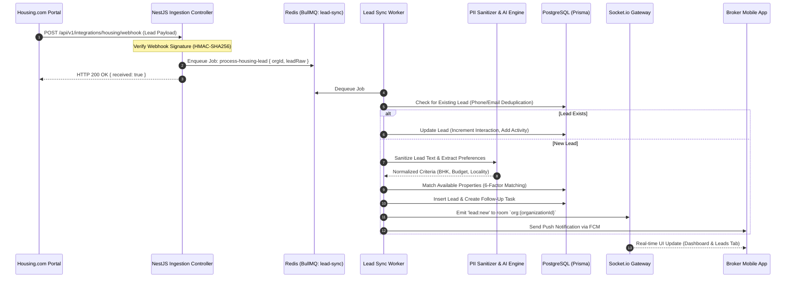
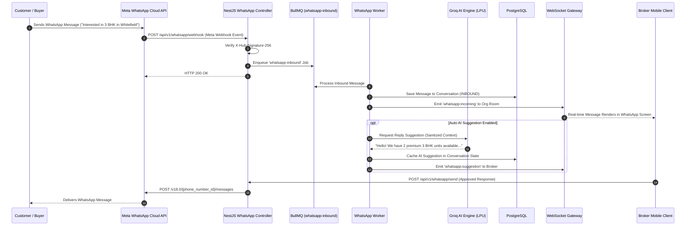

# BrokerIQ — System Architecture Specification

## 1. System Overview & Commercial Purpose

BrokerIQ is an enterprise-grade, multi-tenant SaaS Customer Relationship Management (CRM) and workflow automation platform engineered specifically for the Indian real-estate brokerage market. Indian real estate transactions are characterized by fragmented lead funnels (Housing.com, 99acres, MagicBricks, WhatsApp referrals, direct site walk-ins), high-touch relationship management, rapid communication expectations over WhatsApp, and complex team structures ranging from independent solo brokers to multi-branch regional brokerage agencies.

BrokerIQ unifies lead ingestion, intelligent inventory matching, automated follow-up scheduling, site visit tracking, WhatsApp conversation management, AI-driven lead scoring and reply generation, and subscription billing into a cohesive, high-performance platform.

### Architectural Tenets
1. **Multi-Tenant Isolation by Design**: Strict row-level isolation via mandatory `organizationId` foreign keys and composite database indexing, preventing cross-organization data contamination.
2. **Indian Market Optimization**: Native WhatsApp Cloud API integration, SMS/Phone OTP authentication, Indian numbering format (Lakhs and Crores), GST-compliant billing via Razorpay, and bilingual localization (English and Hindi).
3. **Monorepo Unified Architecture**: Shared domain types, Zod schemas, state machines, and API contracts shared across NestJS backend, Next.js admin portal, and React Native mobile client.
4. **Resilient Asynchronous Pipeline**: Heavy or external tasks (Housing.com polling, WhatsApp webhook dispatch, AI inference, push notifications) are decoupled into Redis-backed BullMQ queues.
5. **Zero-Trust Security**: AES-256-GCM encrypted credential vault for third-party API keys, JWT family rotation with reuse detection, and strict RBAC guards.

---

## 2. Monorepo Topology & Workspace Structure

BrokerIQ is architected as a high-performance monorepo managed via **Turborepo** and **pnpm workspaces**. The repository segregates concerns into distinct client applications, a backend API service, and a foundational shared domain package.

```
/Users/yashjangid/Desktop/BrokerIQ/
├── package.json                   # Monorepo root configuration & Turborepo pipelines
├── pnpm-workspace.yaml            # Monorepo workspace package definitions
├── turbo.json                     # Turborepo task pipeline (build, test, lint, dev)
├── docker-compose.yml             # Local & staging multi-container orchestration
├── nginx/
│   └── nginx.conf                 # Nginx reverse proxy & SSL termination configuration
├── packages/
│   └── shared/                    # @brokeriq/shared: Single source of domain truth
│       ├── package.json
│       ├── tsconfig.json
│       └── src/
│           ├── enums/             # Role, LeadStage, PropertyType, PaymentStatus, etc.
│           ├── constants/         # Stage state machines, permission matrices, limits
│           ├── types/             # Common DTOs, JWT payloads, API envelopes
│           ├── schemas/           # Zod validation schemas for all entities
│           └── utils/             # Indian currency formatting (Lakh/Crore), regex
└── apps/
    ├── api/                       # NestJS REST & WebSocket API backend
    │   ├── package.json
    │   ├── tsconfig.json
    │   ├── prisma/
    │   │   ├── schema.prisma      # PostgreSQL 16 schema with 33 models
    │   │   └── seed.ts            # Development & staging database seeder
    │   └── src/
    │       ├── main.ts            # Application bootstrap & global middleware
    │       ├── app.module.ts      # Root dependency injection container
    │       ├── common/            # Guards, decorators, filters, interceptors
    │       ├── gateways/          # Socket.io real-time WebSocket gateway
    │       └── modules/           # 21 modular business feature domains
    ├── mobile/                    # React Native + Expo mobile application
    │   ├── package.json
    │   ├── app.json               # Expo SDK configuration
    │   ├── tailwind.config.js     # NativeWind theme (Deep Teal & Emerald)
    │   ├── components/ui/         # 21 atomic & composite design system components
    │   └── app/                   # Expo Router file-based screen navigation
    └── admin/                     # Next.js 14 Super Admin web portal
        ├── package.json
        ├── tailwind.config.ts     # Admin portal styling
        └── src/app/               # Next.js App Router (Dashboard, Orgs, Plans, Vault)
```

---

## 3. High-Level System Architecture Diagram

```
                                  ┌────────────────────────────────────────────────────────┐
                                  │                     CLIENT LAYER                       │
                                  ├────────────────────────────┬───────────────────────────┤
                                  │    Next.js Super Admin     │    React Native Mobile    │
                                  │      (Browser Web)         │      (iOS & Android)      │
                                  └─────────────┬──────────────┴─────────────┬─────────────┘
                                                │                            │
                                                │ HTTPS / REST               │ HTTPS / WSS
                                                ▼                            ▼
┌──────────────────────────────────────────────────────────────────────────────────────────┐
│                                INGRESS & REVERSE PROXY                                   │
│                        Nginx (Port 80/443 SSL Termination)                               │
│      - Reverse proxy routes /api/v1 -> NestJS API:4000                                   │
│      - Reverse proxy routes /admin  -> Next.js Admin:3000                                │
│      - WebSocket upgrade handling on /socket.io/ -> NestJS Gateway:4000                  │
└───────────────────────────────────────────────┬──────────────────────────────────────────┘
                                                │
                                                ▼
┌──────────────────────────────────────────────────────────────────────────────────────────┐
│                                APPLICATION CORE (NestJS API)                             │
│ ┌───────────────────────┬──────────────────────┬───────────────────┬───────────────────┐ │
│ │ Security & Auth       │ Multi-Tenancy        │ CRM Core          │ Automation & Ops  │ │
│ │ - JWT Token Families  │ - Tenant Context     │ - Leads Pipeline  │ - BullMQ Producer │ │
│ │ - Phone/OTP (Redis)   │ - Org Scoping Guard  │ - Properties CRUD │ - Rule Evaluator  │ │
│ │ - RBAC RolesGuard     │ - Quota Enforcement  │ - Follow-Ups / SV │ - Housing Sync    │ │
│ │ - Helmet & Throttler  │ - Feature Flags      │ - Customer Sync   │ - WhatsApp Dispatch│ │
│ └───────────────────────┴──────────────────────┴───────────────────┴───────────────────┘ │
│ ┌──────────────────────────────────────────────────────────────────────────────────────┐ │
│ │ Infrastructure Services                                                              │ │
│ │ - EncryptionService (AES-256-GCM Credential Vault)                                   │ │
│ │ - AIProvider (Groq LPU LLM Interface & PII Sanitizer)                                │ │
│ │ - PaymentProvider (Razorpay Gateway & Webhook Signature Verifier)                    │ │
│ │ - StorageService (DigitalOcean Spaces S3 Presigned URLs)                             │ │
│ │ - NotificationService (Firebase Cloud Messaging Gateway)                             │ │
│ └──────────────────────────────────────────────────────────────────────────────────────┘ │
└───────────────────────────────┬──────────────────────────────┬───────────────────────────┘
                                │                              │
                                ▼                              ▼
┌────────────────────────────────────────────────┐ ┌───────────────────────────────────────┐
│              PERSISTENCE TIER                  │ │             CACHE & QUEUE TIER        │
│       PostgreSQL 16 (via Prisma ORM)           │ │              Redis 7 In-Memory        │
│ - 33 Models across 7 entity groups             │ │ - BullMQ Queues:                      │
│ - Mandatory organizationId on business entities│ │   * lead-sync, whatsapp-inbound       │
│ - Composite B-Tree indices on [orgId, created] │ │   * whatsapp-outbound, notifications  │
│ - Soft deletion on core transactional models   │ │   * automations                       │
│ - UTC timestamps & standard INR currency types │ │ - Session store & OTP token cache     │
│                                                │ │ - Token family revocation blacklist   │
└────────────────────────────────────────────────┘ └───────────────────────────────────────┘
```

---

## 4. End-to-End Data Flow Diagrams

### 4.1 Housing.com Lead Ingestion & Distribution Flow



### 4.2 Inbound & Outbound WhatsApp Messaging Flow



---

## 5. NestJS Backend Architecture & Module Topology

The backend application (`apps/api`) is structured into **21 distinct functional modules**, organized strictly around Domain-Driven Design (DDD) principles. Every module encapsulates its own controllers, services, DTOs, and repository interactions.

```
apps/api/src/modules/
├── auth/                 # Dual-mode authentication (Password & OTP), token rotation
├── organizations/        # Multi-tenant organization CRUD, member management, lifecycle
├── users/                # User profiles, avatar management, staff assignments
├── plans/                # SaaS subscription tier definitions (FOUNDER, STARTER, PRO, BUSINESS)
├── subscriptions/        # Active tenant subscription states, renewals, trials, cancellations
├── payments/             # Razorpay provider, manual billing, webhooks, tax invoices
├── customers/            # Customer contact directory with organization scoping
├── leads/                # 9-stage pipeline, lead qualification, automatic scoring
├── properties/           # Real estate inventory, Housing.com sync, 6-factor matching engine
├── follow-ups/           # Actionable scheduling, completion tracking, overdue detection
├── site-visits/          # Physical walkthrough coordination, no-show and completion states
├── whatsapp/             # Meta Cloud API integration, templates, chat threads, media
├── housing/              # Housing.com webhook ingestion, credential polling, test connection
├── ai/                   # Groq provider integration, PII anonymizer, reply suggestions
├── automations/          # Configurable workflow triggers, delays, and business hour actions
├── analytics/            # Broker KPI aggregation and Super Admin platform metrics
├── notifications/        # In-app notification center and FCM push notification dispatcher
├── storage/              # DigitalOcean Spaces S3 presigned URL generation and media handling
├── admin-settings/       # Global, per-plan, and per-tenant system settings and feature flags
├── credential-center/    # AES-256-GCM encrypted vault for third-party service credentials
├── audit-logs/           # Tamper-evident operational audit trail recorder
└── health/               # Comprehensive readiness and liveness probes (DB, Redis, Queues)
```

### Dependency Injection Hierarchy
Each module registers its providers in NestJS `Module` definitions. Cross-module dependencies are shared cleanly via exported services:
- `PrismaModule` (global) exports `PrismaService` for database access.
- `QueueModule` (global) exports BullMQ queue instances.
- `CommonModule` (global) exports `EncryptionService`, `TenantContextService`, and security guards.

---

## 6. Real-Time WebSocket Architecture

Real-time bi-directional synchronization is delivered via `@nestjs/websockets` powered by **Socket.io**. Real-estate agents in the field receive immediate notification of new incoming leads and WhatsApp messages without manual polling.

### Connection Lifecycle & Security
1. **Handshake Authentication**: The client establishes a WebSocket connection to the `/ws` namespace, providing an access JWT in `auth.token` or headers.
2. **Tenant Scoping & Room Join**: The gateway validates the token, extracts `organizationId` and `userId`, and assigns the socket to two rooms:
   - `org:{organizationId}` — for shared tenant-wide events (e.g., new unassigned leads, inventory updates).
   - `user:{userId}` — for private user-specific events (e.g., assigned follow-up reminders, direct notifications).
3. **Heartbeat & Reconnection**: Standard Socket.io ping/pong interval (25 seconds) maintains connection health across mobile network transitions.

### Event Topology
| Event Name | Direction | Payload | Description |
|---|---|---|---|
| `connection` | Client -> Server | `{ token: string }` | Authenticates and establishes room memberships |
| `lead:new` | Server -> Client | `LeadEntity` | Broadcasts newly ingested lead to the organization |
| `lead:stage_changed` | Server -> Client | `{ leadId, fromStage, toStage }` | Synchronizes stage change across broker devices |
| `whatsapp:incoming` | Server -> Client | `WhatsAppMessageEntity` | Delivers incoming WhatsApp chat message |
| `whatsapp:status` | Server -> Client | `{ messageId, status }` | Updates message status (sent, delivered, read) |
| `notification:push` | Server -> Client | `NotificationEntity` | Sends in-app operational alert or reminder |

---

## 7. Asynchronous Queueing & BullMQ Architecture

BrokerIQ handles heavy and external third-party I/O asynchronously using **BullMQ** backed by **Redis 7**. This ensures the NestJS HTTP event loop remains unblocked, maintaining sub-50ms API response times.

```
┌────────────────────────────────────────────────────────────────────────┐
│                        BULLMQ QUEUE TOPOLOGY                           │
├────────────────────┬────────────────────┬──────────────┬───────────────┤
│ Queue Name         │ Job Types          │ Concurrency  │ Retry Policy  │
├────────────────────┼────────────────────┼──────────────┼───────────────┤
│ lead-sync          │ process-housing    │ 5 workers    │ 3 retries,    │
│                    │ process-portal     │              │ exp backoff   │
├────────────────────┼────────────────────┼──────────────┼───────────────┤
│ whatsapp-inbound   │ parse-inbound      │ 10 workers   │ 3 retries,    │
│                    │ trigger-ai-reply   │              │ immediate     │
├────────────────────┼────────────────────┼──────────────┼───────────────┤
│ whatsapp-outbound  │ send-template      │ 5 workers    │ 5 retries,    │
│                    │ send-message       │              │ rate-limited  │
├────────────────────┼────────────────────┼──────────────┼───────────────┤
│ notifications      │ send-fcm           │ 10 workers   │ 2 retries     │
│                    │ send-email         │              │               │
├────────────────────┼────────────────────┼──────────────┼───────────────┤
│ automations        │ evaluate-rules     │ 5 workers    │ 2 retries     │
│                    │ scheduled-delay    │              │               │
└────────────────────┴────────────────────┴──────────────┴───────────────┘
```

### BullMQ Worker Guarantees
- **At-Least-Once Delivery**: Jobs are acknowledged only after database persistence or external API confirmation.
- **Deduplication**: Job IDs are hashed from incoming webhook payloads to prevent duplicate processing during external API retries.
- **Failed Job Dead-Letter Handling**: Jobs failing all retry attempts transition to `failed` state and appear on the Super Admin Health dashboard with one-click retry capability.

---

## 8. Scalability & Operational Considerations

### Stateless API Tier
The NestJS application maintains zero local in-memory session state. Authentication tokens are verified statelessly via JWT signatures, with token revocation and active user sessions managed via Redis. Multiple instances of `apps/api` can sit behind an Nginx or cloud load balancer with round-robin distribution.

### Database Connection Management
PostgreSQL 16 connections are pooled using Prisma's connection pool manager. In production environments, PgBouncer is deployed ahead of PostgreSQL to support up to 5,000 concurrent client connections while maintaining a lean backend database connection footprint.

### Redis Caching Strategy
- **Tenant Configuration Cache**: System settings and feature flags are cached in Redis with a 5-minute TTL, invalidating immediately upon administrative modification.
- **OTP Rate-Limiting Keys**: Temporary phone number keys with 60-second cooldowns prevent SMS abuse.
- **Token Family Blacklist**: Revoked refresh tokens are stored in Redis until their natural expiration date.

### Horizontal Scaling Roadmap
When platform load scales beyond single-server capacity:
1. Extract BullMQ queue workers into dedicated worker containers, freeing API instances for HTTP traffic.
2. Read-heavy analytics and dashboard queries redirect to a PostgreSQL read replica.
3. Socket.io instances scale across nodes using the `@socket.io/redis-adapter`.
