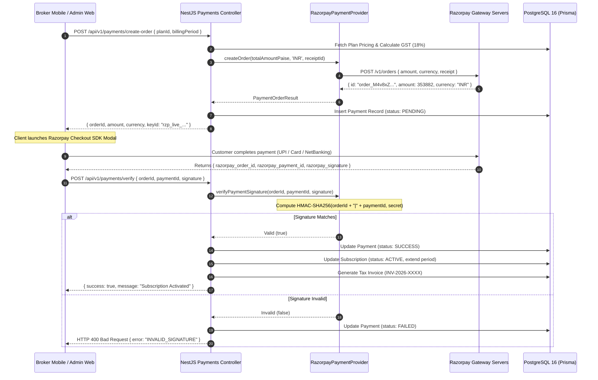

# BrokerIQ — Billing & Payment Architecture Specification

## 1. Overview & Indian SaaS Regulatory Compliance

BrokerIQ's billing engine is architected to satisfy the unique financial and statutory compliance landscape of the Indian SaaS economy. Key regulatory constraints and commercial requirements include:

1. **Reserve Bank of India (RBI) e-Mandate Directives**: Recurring subscription auto-debit on credit/debit cards in India requires compliance with RBI circulars (AFA / Additional Factor of Authentication on mandate registration, pre-debit notifications 24 hours prior to debit, and e-mandate limit thresholds).
2. **Goods and Services Tax (GST) Compliance**: All SaaS invoicing in India must conform to GST council rules, displaying the platform's GSTIN, tenant's GSTIN (if registered for input tax credit), 6-digit SAC code **998314** (Information Technology Software Services), and explicit tax bifurcations:
   - **Intrastate Transactions (Karnataka to Karnataka)**: 9% CGST + 9% SGST = 18% Total GST.
   - **Interstate Transactions (Karnataka to Other Indian States)**: 18% IGST = 18% Total GST.
3. **Multi-Channel Settlement Realities**: Many traditional Indian real-estate broker agencies prefer offline settlement methods (NEFT, RTGS, IMPS, corporate cheques, or UPI direct transfer) over recurring card mandates. The billing architecture must treat offline manual billing as a first-class citizen alongside automated gateways.

---

## 2. Payment Provider Abstraction Layer

To prevent tight coupling to a single payment gateway and permit seamless geographic or multi-gateway expansion (e.g. Stripe for international accounts), BrokerIQ establishes a strict `PaymentProvider` abstraction interface.

```typescript
// apps/api/src/modules/payments/providers/payment-provider.interface.ts

export interface PaymentOrderOptions {
  amount: number;             // Amount in smallest currency unit (paise for INR)
  currency: string;           // 'INR'
  receipt: string;            // Internal reference ID (e.g. 'rcpt_sub_1234')
  notes?: Record<string, string>;
}

export interface PaymentOrderResult {
  orderId: string;            // Gateway order ID (e.g. 'order_xxx')
  amount: number;
  currency: string;
  provider: 'RAZORPAY' | 'STRIPE' | 'MANUAL';
  keyId?: string;             // Public key for client-side checkout SDK
}

export interface WebhookResult {
  handled: boolean;
  eventType: string;
  subscriptionId?: string;
  paymentId?: string;
  amount?: number;
  status?: 'SUCCESS' | 'FAILED' | 'PENDING';
  rawPayload: any;
}

export interface PaymentProvider {
  /**
   * Initializes a one-time order for checkout
   */
  createOrder(options: PaymentOrderOptions): Promise<PaymentOrderResult>;

  /**
   * Verifies cryptographic signature received from client checkout
   */
  verifyPaymentSignature(
    orderId: string,
    paymentId: string,
    signature: string
  ): boolean;

  /**
   * Processes and validates incoming gateway webhooks
   */
  processWebhook(
    rawBody: Buffer | string,
    signatureHeader: string
  ): Promise<WebhookResult>;

  /**
   * Creates an automated recurring subscription mandate
   */
  createSubscription(
    planId: string,
    customerDetails: { name: string; email: string; phone: string }
  ): Promise<{ subscriptionId: string; shortUrl?: string }>;

  /**
   * Cancels a recurring subscription mandate
   */
  cancelSubscription(subscriptionId: string): Promise<boolean>;
}
```

### Registered Provider Implementations
- `RazorpayPaymentProvider`: Primary automated provider utilizing the Razorpay Node.js SDK and Subscriptions API.
- `ManualPaymentProvider`: Internal offline provider managing bank transfer approvals, cheque clearances, and zero-amount founder allocations.
- `StripePaymentProvider` *(Roadmap)*: International provider for foreign real-estate investors and overseas brokers.

---

## 3. Razorpay Integration Flow & Cryptographic Verification



### Signature Verification Algorithm
Razorpay checkout signatures are verified using strict HMAC-SHA256 hashing. The backend strictly prohibits trusting client confirmation without mathematical signature proof:

```typescript
public verifyPaymentSignature(
  orderId: string,
  paymentId: string,
  signature: string
): boolean {
  const secret = this.configService.get<string>('RAZORPAY_KEY_SECRET');
  const payload = `${orderId}|${paymentId}`;
  const generatedSignature = crypto
    .createHmac('sha256', secret)
    .update(payload)
    .digest('hex');

  // Use timingSafeEqual to guard against timing analysis attacks
  const signatureBuffer = Buffer.from(signature, 'utf8');
  const expectedBuffer = Buffer.from(generatedSignature, 'utf8');

  if (signatureBuffer.length !== expectedBuffer.length) {
    return false;
  }
  return crypto.timingSafeEqual(signatureBuffer, expectedBuffer);
}
```

---

## 4. Webhook Processing Architecture & Idempotency

External gateways deliver asynchronous notifications for recurring subscription events. Webhooks are handled via a dedicated, non-blocking ingestion pipeline.

```
                    INCOMING RAZORPAY WEBHOOK
                               │
                               ▼
┌──────────────────────────────────────────────────────────────┐
│ 1. Raw Payload & Signature Extraction                        │
│    Header: X-Razorpay-Signature                              │
│    Body: Buffer (Preserves exact raw byte representation)    │
└──────────────────────────────┬───────────────────────────────┘
                               │
                               ▼
┌──────────────────────────────────────────────────────────────┐
│ 2. Cryptographic Webhook Signature Validation                │
│    HMAC-SHA256(rawBody, RAZORPAY_WEBHOOK_SECRET) == Header  │
│    If mismatch -> Immediate HTTP 400 rejection               │
└──────────────────────────────┬───────────────────────────────┘
                               │
                               ▼
┌──────────────────────────────────────────────────────────────┐
│ 3. Database Idempotency Gate (WebhookEvent Table)            │
│    Check if `eventId` (e.g. `event_M8y9...`) already exists  │
│    If exists -> Acknowledge HTTP 200 OK immediately (no-op)  │
│    If new    -> Insert WebhookEvent (processed: false)       │
└──────────────────────────────┬───────────────────────────────┘
                               │
                               ▼
┌──────────────────────────────────────────────────────────────┐
│ 4. Asynchronous Queue Dispatch (BullMQ: payments)            │
│    Enqueue job: process-payment-webhook { eventId, payload } │
│    Return HTTP 200 OK to Razorpay within < 200ms             │
└──────────────────────────────────────────────────────────────┘
```

### Supported Webhook Events & Lifecycle Actions
1. `subscription.activated`:
   - Matches `razorpaySubscriptionId`.
   - Transitions `Subscription.status` from `TRIALING` or `PAST_DUE` to `ACTIVE`.
   - Resets monthly `UsageCounter` metrics.
2. `subscription.charged` / `payment.captured`:
   - Records new `Payment` record with `PaymentStatus.SUCCESS`.
   - Advances `currentPeriodStart` and `currentPeriodEnd`.
   - Dispatches automated Tax Invoice generation job.
3. `payment.failed`:
   - Transitions `Subscription.status` to `PAST_DUE`.
   - Enqueues high-priority notification to `BROKER_ADMIN` via WhatsApp and FCM.
   - Begins 3-day dunning countdown.
4. `subscription.cancelled`:
   - Transitions `Subscription.status` to `CANCELLED`.
   - Flags account for post-period termination.

---

## 5. Offline Manual Billing & Administrative Settlements

A critical capability for the Indian commercial property market is manual offline onboarding. Large agencies frequently pay annually via NEFT/RTGS bank transfers or corporate cheques.

### Manual Billing Workflow
1. **Administrative Invoice Draft**: Super Admin accesses `/subscriptions` in the Next.js admin panel and selects "Create Manual Billing Settlement".
2. **Payment Detail Entry**: Super Admin inputs transaction metadata:
   - Settlement Method: `BANK_TRANSFER`, `CHEQUE`, `UPI`, or `CASH`.
   - Transaction Reference: UTR Number (for NEFT/RTGS), Cheque Number, or UPI Transaction ID.
   - Bank Name & Branch.
   - Payment Received Date.
3. **Execution & Audit Record**:
   - Backend creates a `Payment` entity with `provider = 'MANUAL'` and `status = 'SUCCESS'`.
   - Updates tenant `Subscription` to `ACTIVE` with duration set to 30 days (monthly) or 365 days (annual).
   - Writes an immutable record to `AuditLog` capturing Super Admin identity, timestamp, and IP address.
   - Automatically generates and emails an official GST-compliant tax invoice marked "PAID VIA OFFLINE TRANSFER".

---

## 6. Indian GST Calculation & Automated Invoicing Engine

### 6.1 Statutory GST Algorithm
The billing engine applies the following formula based on the tenant organization's registered Indian state:

```
Inputs:
  Subtotal (Base Plan Price) = S
  Platform State Code        = 29 (Karnataka)
  Tenant Organization State  = T_state

Computation:
  If T_state == "Karnataka" (Intrastate):
    CGST Rate = 9.0%  -> CGST_Amount = Round(S * 0.09)
    SGST Rate = 9.0%  -> SGST_Amount = Round(S * 0.09)
    IGST Rate = 0.0%  -> IGST_Amount = 0
  Else (Interstate, e.g. Maharashtra, Delhi, Haryana):
    CGST Rate = 0.0%  -> CGST_Amount = 0
    SGST Rate = 0.0%  -> SGST_Amount = 0
    IGST Rate = 18.0% -> IGST_Amount = Round(S * 0.18)

Total Tax Amount = CGST_Amount + SGST_Amount + IGST_Amount
Invoice Total Amount = S + Total Tax Amount
```

### 6.2 Invoice Numbering & Layout Standards
- **Sequential Standard**: `INV-{YYYY}-{00000}` (e.g. `INV-2026-00108`), reset annually.
- **Service Accounting Code (SAC)**: `998314` (Information technology software services).
- **Mandatory PDF Data Fields**:
  - BrokerIQ Legal Entity Name, Office Address, GSTIN, PAN, and Bank Details.
  - Client Agency Legal Name, Address, and Client GSTIN (if provided for tax credit).
  - Itemized Description: Plan Name, Billing Cycle (e.g., "Pro Tier Monthly Subscription: 26 Sep 2026 – 25 Oct 2026").
  - Tax Breakdown table displaying SAC Code, Taxable Value, CGST, SGST, IGST, and Total Tax.
  - Computer-generated digital signature disclaimer.

---

## 7. Dunning Management & Grace Period Policies

When automated subscription renewals fail, BrokerIQ protects broker operations from abrupt termination while enforcing financial recovery.

```
Day 0 (Debit Fails)   ──> Subscription status: PAST_DUE
                          Payment retry scheduled (+24 hours)
                          WhatsApp & Email alert dispatched to Broker Admin

Day 1 (Retry 1 Fails) ──> Second automated notification
                          In-app warning banner: "Payment Overdue - 2 Days Remaining"

Day 2 (Retry 2 Fails) ──> Final payment retry scheduled
                          SMS alert with direct UPI payment link

Day 3 (Grace End)     ──> Final payment attempt fails
                          Automated transition: Subscription -> SUSPENDED
                          Logins blocked across mobile & web apps
                          External lead webhooks held in 7-day reserve queue
```

This 3-day buffer ensures brokers negotiating high-value property transactions do not suffer sudden disruption due to temporary banking gateway timeouts or credit limit holds.
