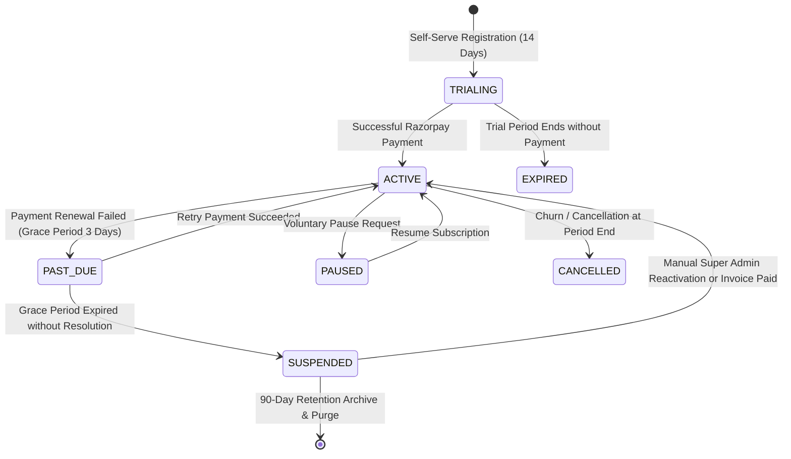

# BrokerIQ — Multi-Tenancy & SaaS Architecture Specification

## 1. Multi-Tenancy Isolation Models & Strategic Rationale

Multi-tenancy is the architectural bedrock of BrokerIQ. In the Indian real-estate software sector, where agencies range from independent brokers to enterprise brokerage franchises with hundreds of field agents, the multi-tenancy model must balance **rock-solid cryptographic data isolation**, **low operating cost per tenant**, and **instantaneous onboarding without database provisioning delay**.

### Comparison of Multi-Tenancy Patterns

| Dimension | Separate Database per Tenant | Separate Schema per Tenant | Shared Database + Row-Level Isolation (BrokerIQ) |
|---|---|---|---|
| **Data Isolation** | Maximum physical boundary | Logical schema boundary | Strict logical row boundary via Foreign Keys & Guards |
| **Operational Overhead** | Extremely High (thousands of DBs to migrate/backup) | Moderate (connection pool saturation, DDL migration overhead) | Minimal (single schema, standard zero-downtime migrations) |
| **Infrastructure Cost** | Prohibitive for Solo/Starter tiers | High memory footprint for connection pools | Optimal (enables viable pricing at ₹999/month for solo brokers) |
| **Tenant Onboarding Latency** | Minutes (provisioning, migration) | Seconds (DDL create schema) | **Milliseconds** (single row insert into `Organization`) |
| **Cross-Tenant Aggregation** | Extremely complex ETL pipelines | Complex cross-schema queries | **Native SQL** for Super Admin platform analytics |

### BrokerIQ Strategic Decision: Shared Database with Row-Level Isolation
BrokerIQ implements a **Shared Database with Row-Level Isolation** backed by PostgreSQL 16. Tenant isolation is guaranteed through three coordinated software layers:
1. **Mandatory Foreign Key Constraint**: Every business entity table in the database contains an `organizationId` foreign key column pointing to `Organization.id`. Null values are strictly prohibited on business entities.
2. **Contextual Tenant Guard (`TenantGuard`)**: A global NestJS guard intercepts every incoming API request, extracts the validated `organizationId` from the cryptographically verified JWT claims, and injects it into a request-scoped `TenantContext`.
3. **Automated Query Scoping (Prisma Middleware / Extensions)**: All read, write, update, and delete queries automatically inject `{ where: { organizationId: tenantContext.id } }`. Organization A cannot query, view, or modify Organization B's data under any condition.

---

## 2. Tenant Context Lifecycle & Request Pipeline

```
                                 INCOMING HTTP REQUEST
                                           │
                                           ▼
┌──────────────────────────────────────────────────────────────────────────────────────────┐
│ 1. INGRESS & TLS TERMINATION (Nginx)                                                     │
│    - Extracts Host header (e.g. apexrealty.brokeriq.in or api.brokeriq.in)               │
│    - Forwards to NestJS API Gateway (Port 4000)                                          │
└──────────────────────────────────────────┬───────────────────────────────────────────────┘
                                           │
                                           ▼
┌──────────────────────────────────────────────────────────────────────────────────────────┐
│ 2. AUTHENTICATION & JWT EXTRACTION (JwtAuthGuard)                                        │
│    - Extracts `Authorization: Bearer <accessToken>`                                      │
│    - Validates HMAC-SHA256 signature and expiration                                      │
│    - Unpacks claims: { sub: userId, role: Role, organizationId: orgId }                  │
└──────────────────────────────────────────┬───────────────────────────────────────────────┘
                                           │
                                           ▼
┌──────────────────────────────────────────────────────────────────────────────────────────┐
│ 3. TENANT RESOLUTION & VALIDATION (TenantGuard)                                          │
│    - Verifies `organizationId` from JWT claim                                            │
│    - Checks optional `X-Tenant-Id` header (strictly restricted to SUPER_ADMIN role)      │
│    - Queries Redis cache for tenant status:                                              │
│      * If status == 'SUSPENDED': Throws HTTP 403 Forbidden ("Organization Suspended")    │
│      * If status == 'ACTIVE' or 'TRIALING': Binds tenant to RequestContext               │
└──────────────────────────────────────────┬───────────────────────────────────────────────┘
                                           │
                                           ▼
┌──────────────────────────────────────────────────────────────────────────────────────────┐
│ 4. SERVICE & REPOSITORY EXECUTION                                                        │
│    - Controller delegates to domain service (e.g. LeadsService.findAll)                  │
│    - Prisma query executed:                                                              │
│      `prisma.lead.findMany({ where: { organizationId: ctx.orgId, deletedAt: null } })`  │
│    - Zero cross-tenant data leakage guaranteed                                           │
└──────────────────────────────────────────────────────────────────────────────────────────┘
```

---

## 3. Subscription Plan Architecture & Tier Hierarchy

BrokerIQ defines **4 commercial plan tiers** designed to support real-estate businesses at every stage of their growth journey.

```
┌────────────────────────────────────────────────────────────────────────┐
│                        COMMERCIAL PLAN TIERS                           │
├───────────────┬──────────────┬──────────────┬──────────────────────────┤
│ Plan Tier     │ Price (Mo)   │ Price (Yr)   │ Target Audience          │
├───────────────┼──────────────┼──────────────┼──────────────────────────┤
│ FOUNDER       │ ₹0 (VIP)     │ ₹0 (VIP)     │ Early Adopters & VIPs    │
│ STARTER       │ ₹999         │ ₹9,990       │ Solo Property Brokers    │
│ PRO           │ ₹2,999       │ ₹29,990      │ Growing Broker Agencies  │
│ BUSINESS      │ ₹7,999       │ ₹79,990      │ Large Brokerage Firms    │
└───────────────┴──────────────┴──────────────┴──────────────────────────┘
```

### Detailed Tier Limits & Entitlements

| Feature / Limit Key | FOUNDER | STARTER | PRO | BUSINESS |
|---|---|---|---|---|
| **Max User Accounts** (`MAX_USERS`) | Unlimited (`-1`) | 1 User | 5 Users | Unlimited (`-1`) |
| **Max Monthly Leads** (`MAX_LEADS_PER_MONTH`) | Unlimited (`-1`) | 100 Leads | 1,000 Leads | Unlimited (`-1`) |
| **Max Active Properties** (`MAX_PROPERTIES`) | Unlimited (`-1`) | 50 Properties | 500 Properties | Unlimited (`-1`) |
| **WhatsApp Messages/Mo** (`MAX_WHATSAPP_PER_MONTH`)| 10,000 Messages | 500 Messages | 5,000 Messages | 25,000 Messages |
| **AI LLM Queries/Mo** (`MAX_AI_CALLS_PER_MONTH`) | 2,000 Queries | 50 Queries | 500 Queries | 2,500 Queries |
| **Document/Media Storage** (`STORAGE_LIMIT_MB`) | 10,000 MB (10GB)| 500 MB | 5,000 MB (5GB) | 50,000 MB (50GB)|
| **Housing.com Webhook Sync** (`housing_auto_sync`) | Enabled | Disabled | Enabled | Enabled |
| **AI Smart Reply Suggestions** (`ai_reply_suggestion`)| Enabled | Disabled | Enabled | Enabled |
| **WhatsApp Audio Notes** (`whatsapp_voice_notes`) | Enabled | Disabled | Enabled | Enabled |
| **Automated Follow-up Workflows** (`automation_rules`)| Enabled | Basic (1 Rule) | Advanced (10 Rules)| Unlimited (`-1`) |
| **Customer Support SLA** | Priority WhatsApp | Email (48h) | Email + Chat (12h)| Dedicated RM (1h) |

---

## 4. Quota Enforcement & Metering System

To maintain system stability and enforce tier boundaries, BrokerIQ implements a dual-layer metering architecture combining Redis for low-latency atomic checks and PostgreSQL for authoritative billing audits.

### 4.1 Metering Architecture
1. **Usage Counter Tracking**: Monthly usage is tracked in the `UsageCounter` table, partitioned by `organizationId`, `metricKey`, and `periodStart` (the first day of the tenant's current billing cycle).
2. **Atomic In-Memory Tracking**: For high-velocity actions (e.g. Inbound/Outbound WhatsApp messages, AI queries), Redis `INCR` commands are executed against keys structured as `usage:{orgId}:{metricKey}:{YYYY-MM}`.
3. **Asynchronous DB Sync**: BullMQ workers periodically flush Redis usage counters back to PostgreSQL `UsageCounter` records every 5 minutes.

### 4.2 The `@CheckQuota()` Decorator & `QuotaGuard`
Controllers protect quota-restricted endpoints using custom NestJS decorators:

```typescript
@Post()
@Roles(Role.BROKER_ADMIN, Role.BROKER_STAFF)
@CheckQuota({ metric: 'MAX_LEADS_PER_MONTH', counterKey: 'LEADS_COUNT' })
async createLead(@Req() req: Request, @Body() dto: CreateLeadDto) {
  return this.leadsService.create(req.tenantContext.id, dto);
}
```

#### Quota Evaluation Algorithm:
1. `QuotaGuard` resolves `organizationId` from `req.tenantContext`.
2. Resolves the tenant's active plan and associated `FeatureLimit.limitValue`.
3. If `limitValue === -1` (unlimited), request proceeds immediately.
4. Checks current consumption from Redis/PostgreSQL.
5. If `currentValue >= limitValue`, throws `402 Payment Required`:
   ```json
   {
     "success": false,
     "error": {
       "code": "QUOTA_EXCEEDED",
       "message": "Monthly lead limit of 100 reached. Please upgrade to Pro tier.",
       "details": {
         "metric": "MAX_LEADS_PER_MONTH",
         "current": 100,
         "limit": 100,
         "upgradeUrl": "/subscription"
       }
     }
   }
   ```

---

## 5. Three-Tier Feature Flag Hierarchy & Resolution Engine

Feature flags control granular product capabilities. BrokerIQ evaluates flags using a deterministic **3-tier resolution engine**:

```
                                  EVALUATE FLAG: key
                                           │
                                           ▼
                    ┌─────────────────────────────────────────────┐
                    │ Tier 1: Tenant-Specific Override            │
                    │ Query SystemSetting / OrganizationFlag DB   │
                    └──────────────────────┬──────────────────────┘
                                           │
                           Found? ─────────┴───────── Not Found?
                             │                             │
                             ▼                             ▼
                      Return Value           ┌─────────────────────────────┐
                                             │ Tier 2: Plan Tier Setting   │
                                             │ Query FeatureFlag.planTiers │
                                             └──────────────┬──────────────┘
                                                            │
                                            Found? ─────────┴───────── Not Found?
                                              │                             │
                                              ▼                             ▼
                                       Return Value           ┌─────────────────────────────┐
                                                              │ Tier 3: Global System Flag  │
                                                              │ FeatureFlag.globalDefault   │
                                                              └──────────────┬──────────────┘
                                                                             │
                                                                             ▼
                                                                        Return Value
```

### Resolution Order Rationale
- **Tenant Override (Tier 1)**: Allows Super Admin to enable beta features (e.g. `housing_auto_sync`) for a specific strategic customer regardless of plan.
- **Plan Tier (Tier 2)**: Standard gate allowing capabilities to be bundled into commercial packages (e.g. `ai_reply_suggestion` enabled for PRO and BUSINESS).
- **Global Default (Tier 3)**: Platform-wide emergency killswitch allowing Super Admin to instantaneously disable an integration platform-wide if an external API suffers downtime.

---

## 6. Tenant Lifecycle State Machine

A tenant organization transitions through a well-defined state machine governing system access, login privileges, and data retention:



### Lifecycle State Policies

#### 1. `TRIALING`
- Granted automatically upon initial broker registration.
- Duration: 14 days (STARTER/PRO) or 30 days (FOUNDER).
- Full functional access matching the trial plan tier.
- Countdown banner rendered in mobile and admin apps ("11 days left in trial").

#### 2. `ACTIVE`
- Subscription paid and active.
- Unrestricted access within plan quotas.
- Automatic renewal invoice generated on billing period boundary.

#### 3. `PAST_DUE` (Grace Period)
- Triggered when Razorpay auto-debit fails (insufficient funds, expired card).
- Duration: **3 calendar days**.
- Broker access remains fully functional to avoid disrupting active real-estate deals.
- Daily automated SMS/WhatsApp alerts sent to `BROKER_ADMIN` with direct payment link.

#### 4. `SUSPENDED`
- Triggered after 3-day grace period failure OR via direct Super Admin administrative action.
- **Access Policy**: All logins for organization members are rejected at `TenantGuard` with `403 Forbidden`.
- Inbound webhooks from Housing.com and WhatsApp are queued in Redis for up to 7 days, ensuring no client leads are permanently lost during temporary billing lapses.

#### 5. `CANCELLED`
- Organization voluntarily cancels. Access remains active until `currentPeriodEnd`.
- Upon period expiration, transitions to archived state. Data retained for 90 days in compliance with Indian commercial records guidelines before anonymized purge.
